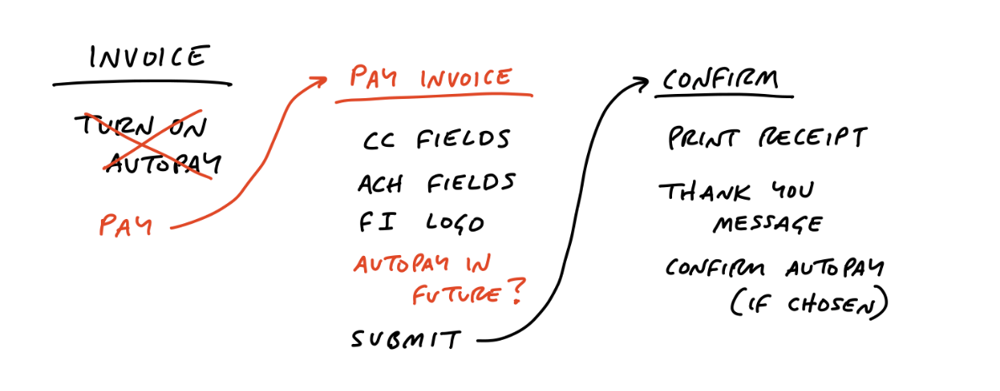
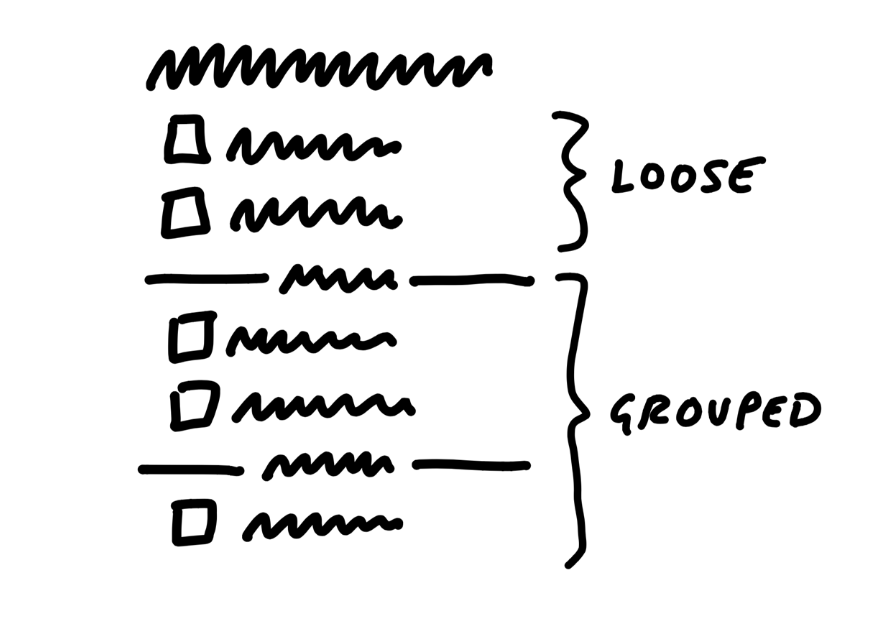

# Passos práticos para refinar um requisito

1. Busque acesso a quem idealizou o requisito.
2. Questione o idealizador do requisito (o objetivo é entender o que ele deseja e identificar a origem da necessidade): análise da causa raiz.
3. Realize double check e triple check:
   * O double check evita a "aprendizagem negativa" (aprender algo errado).
   * O feedback positivo do idealizador do requisito é essencial para validar o entendimento.
   * Utilize o *breadboarding* (do livro *Shape Up*, capítulo "Find the Elements"), que é uma técnica de prototipagem *rápida*. Essa técnica ajuda a compreender o que é necessário, criando diagramas descritivos de como o sistema deve funcionar.
   * Fat marker sketches: consiste em desenhar com caneta grossa, em um papel grande, o que você entendeu do requisito. O objetivo é criar um esboço visual que represente a ideia principal do requisito. Isso ajuda a visualizar o que foi discutido e a identificar possíveis lacunas ou pontos de melhoria.

4. Teste de cenários:
   * Crie cenários de teste para validar o entendimento do requisito. Isso ajuda a garantir que o requisito foi compreendido corretamente e que atende às necessidades do usuário.
   * Utilize TDD (Test Driven Development): escreva testes antes de implementar o código. Isso ajuda a garantir que o código atenda aos requisitos e funcione conforme esperado.
   * Use ferramentas como o Cucumber para descrever cenários de teste de forma clara e compreensível.
5. Descreva o passo a passo de implementação antes de codificar:
   * Crie histórias (artefatos) detalhadas que descrevam o que deve ser feito.
   * Garanta que todos os envolvidos no projeto estejam alinhados antes de iniciar a implementação.
