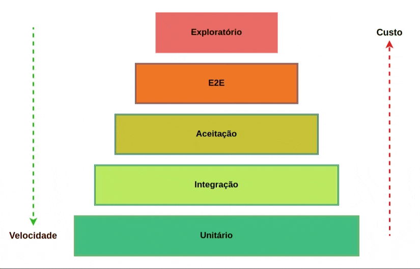

# Testes automatizados: Revelando bugs de maneira eficiente

Segundo a descrição da aula de introdução, a indústria de software utiliza testes principalmente para validar se o código escrito está funcionando como esperado e, caso não esteja, o teste deve falhar. O olhar acadêmico é diferente: parte da ideia de que, normalmente, o teste deve detectar bugs antes que o software seja entregue ao cliente. Se não detectar bugs, espera-se que haja um QA desenvolvedor.

O curso é voltado para ensinar como escrever testes automatizados e como eles podem ser usados para detectar bugs de maneira eficiente, baseado no livro [Effective Software Testing, by Maurício Aniche](https://www.effective-software-testing.com/).

> Teste reveladores de bugs

O Foco dos teste vai ser encontrar bugs, não será usando tdd


## Pirâmide de testes

1. Testes unitários
2. Testes de integração
3. Testes de sistema
4. Testes de aceitação



> O curso irá focar em testes unitários

## Técnicas de testes

### Specification Based Testing

A ideia dessa técnica de teste é que, a partir de uma especificação, seja possível derivar casos de teste. É uma técnica mais utilizada por QAs, mas também pode ser usada por desenvolvedores para tentar encontrar bugs.

#### [Testes Baseados em Especificação - exemplo](specification_based_testes.md)


## Boundary Testing (Teste de Fronteira)

Técnica que combina **particionamento de equivalência** com **teste de limites**.

**Processo:**

1. **Particione** os dados em classes equivalentes (válidas e inválidas)
2. **Teste as fronteiras** entre essas partições

**Exemplo - Campo idade (18-65):**

**Partições:**

- Inválida: < 18
- Válida: 18-65
- Inválida: > 65

**Valores de fronteira testados:**

- 17, 18, 19 (fronteira inferior)
- 64, 65, 66 (fronteira superior)

**Por quê funciona:**

- Particionar reduz casos de teste (valores equivalentes têm mesmo comportamento)
- Fronteiras capturam a maioria dos bugs (erros de operadores `<`, `<=`, etc.)

**Resultado:** Máxima cobertura de defeitos com mínimo de casos de teste.

[Boundary Testing - exemplo](boundary_testing_exemplo.md)

## Structured Testing (Teste Estruturado)

Técnica que utiliza a estrutura do código para guiar os testes. Baseia-se em identificar caminhos lógicos e condições de decisão do proprio código para derivar casos de teste. Usamos nosso fluxos como estrutras condicionais, laços e blocos de código.

[Structured Testing](structured_testing.md)

## Self testing code (design by contract)

A técnica consiste em adicionar validações no código que garantem que ele está funcionando como esperado. Essas validações podem ser feitas através de exceções, asserts ou outras formas de validação, como anotações do Validation do Java.

### Exemplo de código auto-testável

```java
private String nome;
private String sobrenome;

private void invariante() {
    Assert.hasText(nome, "Nome não pode ser vazio");
    Assert.hasText(sobrenome, "Sobrenome não pode ser vazio");
}

private Nome passo1(String nome, String telefone) {
    invariante();
    /**
     * Restante do código
     */
}

private Nome passo2(String sobrenome, String telefone) {
    invariante();
    /**
     * Restante do código
     */
}
```
## Property Based Testing

Técnica que utiliza propriedades do sistema para gerar casos de teste automaticamente. Em vez de escrever casos específicos, definimos propriedades gerais que o código deve satisfazer. Ferramentas como Jqwik ou QuickCheck geram testes baseados nessas propriedades.

### Exemplo de Propriedade

```java
@Label("deveria validar proposta com valor entre x e y") // 1
@Property(tries = 100) // 2
void teste1(@Forall @BigRange(min = 1, max = 99) BigDecimal minimo, // 3
            @Forall @BigRange(min = "101") BigDecimal maximo) { // 4

    Proposta proposta = new Proposta("id", new BigDecimal("100"), 10);

    Assertions.assertTrue(proposta.valorEntre(minimo, maximo),
        "Proposta deve estar entre " + minimo + " e " + maximo);
}
```

1. Rótulo para identificar o teste
2. Número de tentativas para gerar casos
3. Gera valores aleatórios para o mínimo entre 1 e 99
4. Gera valores aleatórios para o máximo a partir de 101


## Testes de unidade o mais integrados possível

Uma dica é usar mocks apenas para interações externas, como classes de banco de dados, serviços externos, etc. Isso ajuda a manter os testes rápidos e focados na lógica interna do código. Dê prioridade para objetos mais próximos dos objetos reais, mesmo que seja necessário criar fakes ou stubs para simular o comportamento de dependências externas.

## Teste na jornada

Durante a Jornada Dev Eficiente, a estratégia adotada para testes será o teste de unidade com Structured Testing, utilizando a técnica MC/DC (Modified Condition/Decision Coverage) e Boundary Testing. A base será o teste unitário, instanciando objetos reais, mas utilizando mocks apenas para interações externas. Para controladores que não possuem branches, utilizaremos testes de integração, normalmente aplicando técnicas como Specification Based Testing e Property Based Testing.
