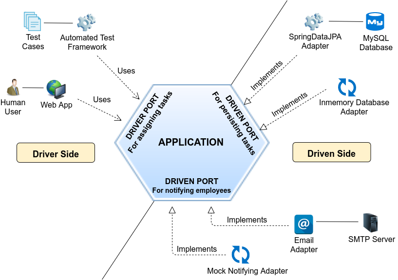

# Design para Testes

## Arquitetura Hexagonal (Ports and Adapters)

A arquitetura hexagonal, também conhecida como "Ports and Adapters", é um padrão de arquitetura que tem como objetivo isolar a lógica de negócio dos detalhes de infraestrutura, como bancos de dados, frameworks, APIs externas, etc.

### Princípios

- **Separação de responsabilidades:** Não misture lógica de negócio com detalhes de infraestrutura.
- **Priorize a lógica de interface e de negócio:** A lógica central da aplicação deve ser independente de detalhes externos.
- **Evite que a "sujeira" da infraestrutura contamine a lógica de negócio:** Adapte a infraestrutura à lógica de negócio, e não o contrário.

> Ao adotar a arquitetura hexagonal, você garante que sua lógica de negócio pode ser testada de forma isolada, sem dependências externas, tornando os testes mais rápidos, confiáveis e fáceis de escrever.

## Observabilidade e controlabilidade

Os métodos de teste devem ser projetados para facilitar a observação do comportamento do sistema e a identificação de problemas. Isso facilita a depuração e a manutenção do código, além de permitir que os testes sejam mais eficazes na detecção de bugs.

> Um sinal de que o código pode não ser bem observável ou controlável é quando os asserts verificam apenas se o valor é diferente de `null`. Prefira asserts que validem o comportamento e os resultados esperados de forma mais precisa.

## Na dúvida, escreva classes pequenas

a philosofhy of software design, uma das afirmações é que classes maiores são preferíveis a classes pequenas, nele tambem se cunha o termo "classites", que são classes pequenas demais.

No entanto, apesar de ser uma afirmação polêmica, é importante considerar que classes pequenas podem ser mais fáceis de testar e manter. Classes menores tendem a ter menos responsabilidades e são mais faceis de entender e testar.
