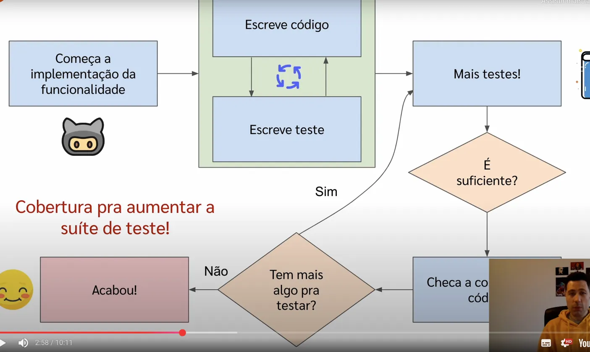

# Testes de Software para Devs: Princípios e Práticas Sistemáticas

Os testes automatizados são uma forma de mitigar bugs e possíveis comportamentos inesperados do código. Eles devem ser fáceis de criar e validar o comportamento esperado.

## Leis do teste de software

1. O teste exaustivo é impossível.
2. A variação de entrada é fundamental.
3. Os bugs tendem a estar localizados.
4. Testes nunca são perfeitos.
5. O contexto é fundamental.
6. O teste é um processo de verificação e não de validação.

## Como criar bons casos de teste

Podemos usar a tecnica de **Teste Baseado em requisito/test based requirement** para criar casos de teste. A ideia é que, a partir de um requisito, seja possível derivar casos de teste. Podemos usar a tecnica definida  pelo Maurício Aniche

## Testes Baseado em Especificação (Domain Testing)

### 1. Olhe para cada entrada de maneira separada
Analise cada parâmetro individualmente: tipos, faixas válidas e inválidas.

### 2. Olhe para como elas interagem
Examine dependências e combinações entre diferentes parâmetros de entrada.

### 3. Regras de domínio
Defina todas as regras de negócio, validações e restrições do sistema.

### 4. Saídas esperadas
Determine os resultados corretos para cada cenário de entrada.

### 5. Simplifica
Reduza casos redundantes mantendo a cobertura essencial dos testes.

### 6. Crie testes

Implemente os casos de teste baseados na análise das etapas anteriores.

---

### [Teste de exemplo usando o Domain Testing](exemplo_domain_testing.md)

---

## Testes Baseados em Boundary (Boundary Testing)

> Os bugs adoram viver nas fronteiras — é aí que temos que testar e ficar atentos.

As fronteiras são os limites entre as condições válidas e inválidas. Bugs tendem a aparecer nessas fronteiras, então é importante testar esses limites. Existem dois conceitos importantes:

- **On-point:** valores identificados como parte da lógica (limite).
- **Off-point:** valores que não são identificados como parte da lógica (fora do limite).

> Tanto on-point quanto off-point podem ser verdadeiros ou falsos, dependendo do contexto e de como a condição é definida. Se o on-point é verdadeiro, o off-point é falso, e vice-versa.

### Exemplos

- `valor > 100`
  - **On-point:** 100 (false)
  - **Off-point:** 101 (true)

- `valor >= 101`
  - **On-point:** 101 (true)
  - **Off-point:** 100 (false)

- `valor == 100`
  - **On-point:** 100 (true)
  - **Off-point:** 101 e 99 (false)

- `valor > n + 1`
  - **On-point:** n+1 (false)
  - **Off-point:** n+2 (true)

- `valor <= 2.0`
  - **On-point:** 2.0 (true)
  - **Off-point:** 2.1 ou 2.000001 (false, a granularidade depende do contexto)

---

### Observação

Essas técnicas podem ser usadas de forma estruturada com código já pronto ou apenas com base no requisito.

## Cobertura de Testes

A cobertura de testes, por si só, não garante que o código esteja bem testado ou que os testes sejam eficazes na detecção de bugs. Ela é apenas uma métrica que pode indicar que mais testes podem ser necessários, mas não assegura a qualidade dos testes realizados.

> Ter alta cobertura de testes não é um problema; o problema é ter baixa cobertura de testes.

**Nota:**
Cobertura de testes mede apenas o quanto do código foi exercitado pelos testes, mas não avalia se os cenários mais críticos e as fronteiras foram realmente testados. É fundamental focar em criar testes que revelem bugs e validem o comportamento esperado, especialmente nos pontos de maior risco e complexidade do sistema.

## Teste de unidade ou teste de integração?

### Teste de unidade

**Vantagens:**
1. Foca em testar pequenas partes do código (funções, métodos, classes).
2. É rápido e fácil de escrever.
3. Facilita a identificação de bugs em partes específicas do código.

**Desvantagens:**
1. Pode não cobrir interações entre diferentes partes do sistema.

### Teste de integração

**Vantagens:**
1. Testa a interação entre diferentes componentes do sistema.
2. Identifica problemas de integração que podem não ser visíveis em testes unitários.
3. Garante que os componentes funcionem juntos como esperado.

**Desvantagens:**
1. Pode ser mais lento e complexo de escrever.

Não existe uma resposta única para essa escolha, pois depende do contexto e dos objetivos do teste. Por exemplo, um endpoint simples que apenas persiste um objeto no banco de dados pode mascarar bugs se todas as interações forem mockadas, já que certos problemas só aparecem ao acessar o banco real. Por outro lado, um algoritmo que faz cálculos complexos pode ser testado de forma mais eficaz com testes unitários, sem a necessidade de acessar o banco de dados.

> Não existe bala de prata: o ideal é combinar ambos os tipos de teste e adaptar a abordagem conforme necessário.

## Testes devem ser simples e rápidos

> Testes simples se multiplicam na base de código!

Testes automatizados devem ser fáceis de entender, rápidos de executar e simples de manter. Quanto mais simples forem os testes, maior será a facilidade de evolução e manutenção da base de código ao longo do tempo.

## Falácia: só testes de integração acham bugs

O nível do teste não é mágico e não encontra bugs sozinho. Para revelar bugs, é fundamental criar casos de teste corretos e bem pensados, independentemente de serem testes unitários ou de integração. O que realmente faz diferença é a qualidade e a abrangência dos cenários testados.

## Dividir para conquistar

Priorize testes unitários de componentes, pois são mais rápidos, fáceis de criar e de manter. Quanto mais testes, maiores as chances de encontrar casos que revelem bugs. Nem sempre é viável, em termos de custo computacional e tempo, criar testes de integração para tudo. Normalmente, criar testes unitários mokando os componentes que não estão sendo testado é um trade-off positivo.

## Foque nos casos de uso

Os casos de uso devem ser fáceis de testar. Estruture o código e os testes para que seja simples validar o comportamento esperado de cada caso de uso.

---

## Como criar testes fáceis

1. Crie uma infraestrutura de testes, APIs, bibliotecas, etc., que facilite a criação e manutenção dos testes.
2. Padronize a escrita dos testes para que todos sigam uma estrutura semelhante, tornando-os mais compreensíveis e fáceis de manter.

---

## É preciso ver valor em todo tipo de teste

É importante reconhecer o valor de todos os tipos de teste, independentemente do nível (unitário, integração, sistema, aceitação). Cada tipo de teste contribui para a qualidade do software e pode revelar diferentes tipos de problemas.

---

## Por que mockar, eis a questão

Mockar é uma técnica que permite simular o comportamento de objetos ou componentes externos, facilitando a criação de testes unitários.

### Quando usar mocks

Utilize mocks para componentes que dificultam a criação de testes, como por exemplo:

- Acesso a banco de dados
- Chamadas a APIs externas
- Interações com sistemas externos

### Quando não usar mocks

Evite mocks quando o objetivo do teste é validar a funcionalidade principal do caso de uso, como por exemplo:

- Verificar se uma query retorna as informações corretas
- Garantir que um objeto está sendo persistido corretamente no banco de dados
- Validar se o endpoint está retornando o status correto

Também não é recomendado mockar entidades que representam o domínio do sistema, como por exemplo:

- DTOs
- Entidades
- Classes de domínio em geral
- Métodos utilitários que não dependem de sistemas externos

### Internal ou peer: uma ótima maneira de classificar dependências

1. **Internal**: Dependências internas são aquelas que pertencem à mesma funcionalidade, sendo componentes separados apenas para facilitar a manutenção e evolução do código. Por serem parte fundamental do que deve ser testado, essas dependências não devem ser mockadas.
2. **Peer**: Dependências peer são aquelas que pertencem a funcionalidades diferentes, mas que interagem entre si. Essas dependências normalmente podem ser mockadas. Um exemplo comum são os repositórios.

### Fakes, stubs e mocks

1. **Stubs** – Objetos que retornam valores pré-definidos, sem lógica de negócio. São usados para simular o comportamento de dependências externas.
2. **Fakes** – Objetos que implementam uma lógica de negócio simples, mas não são tão complexos quanto os objetos reais. São usados para simular o comportamento de dependências externas de forma mais realista (por exemplo, um banco de dados em memória como H2).
3. **Mocks** – Objetos que verificam se métodos específicos foram chamados com os parâmetros corretos. São usados para validar interações entre componentes e é possível fazer asserções sobre o comportamento do código.

### Quais os problemas de mockar demais?

1. **Acomplamento entre classes**: Mockar demais pode levar os teste a acomplarem demais com a implementação, tornando-os frágeis e difíceis de manter.
2. **Contrato do moc e do componente precisam evoluir juntos**: Os testes devem ser modificados sempre que o contrato do mock ou do componente mudar, o que pode aumentar a complexidade e o custo de manutenção dos testes.
