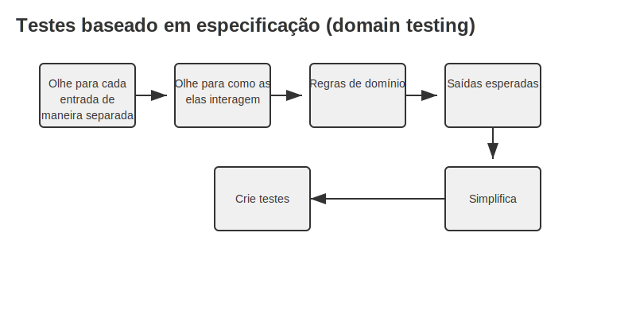

# Testes de Software para Devs: Princípios e Práticas Sistemáticas

Os testes automatizados são uma forma de mitigar bugs e possíveis comportamentos inesperados do código. Eles devem ser fáceis de criar e validar o comportamento esperado.

## Leis do teste de software

1. O teste exaustivo é impossível.
2. A variação de entrada é fundamental.
3. Os bugs tendem a estar localizados.
4. Testes nunca são perfeitos.
5. O contexto é fundamental.
6. O teste é um processo de verificação e não de validação.

## Como criar bons casos de teste

Podemos usar a tecnica de **Teste Baseado em requisito/test based requirement** para criar casos de teste. A ideia é que, a partir de um requisito, seja possível derivar casos de teste. Podemos usar a tecnica definida  pelo Maurício Aniche

## Testes Baseado em Especificação (Domain Testing)

### 1. Olhe para cada entrada de maneira separada
Analise cada parâmetro individualmente: tipos, faixas válidas e inválidas.

### 2. Olhe para como elas interagem
Examine dependências e combinações entre diferentes parâmetros de entrada.

### 3. Regras de domínio
Defina todas as regras de negócio, validações e restrições do sistema.

### 4. Saídas esperadas
Determine os resultados corretos para cada cenário de entrada.

### 5. Simplifica
Reduza casos redundantes mantendo a cobertura essencial dos testes.

### 6. Crie testes

Implemente os casos de teste baseados na análise das etapas anteriores.

---

### [Teste de exemplo usando o Domain Testing](exemplo_domain_testing.md)

---

## Testes Baseados em Boundary (Boundary Testing)

> Os bugs adoram viver nas fronteiras — é aí que temos que testar e ficar atentos.

As fronteiras são os limites entre as condições válidas e inválidas. Bugs tendem a aparecer nessas fronteiras, então é importante testar esses limites. Existem dois conceitos importantes:

- **On-point:** valores identificados como parte da lógica (limite).
- **Off-point:** valores que não são identificados como parte da lógica (fora do limite).

> Tanto on-point quanto off-point podem ser verdadeiros ou falsos, dependendo do contexto e de como a condição é definida. Se o on-point é verdadeiro, o off-point é falso, e vice-versa.

### Exemplos

- `valor > 100`
  - **On-point:** 100 (false)
  - **Off-point:** 101 (true)

- `valor >= 101`
  - **On-point:** 101 (true)
  - **Off-point:** 100 (false)

- `valor == 100`
  - **On-point:** 100 (true)
  - **Off-point:** 101 e 99 (false)

- `valor > n + 1`
  - **On-point:** n+1 (false)
  - **Off-point:** n+2 (true)

- `valor <= 2.0`
  - **On-point:** 2.0 (true)
  - **Off-point:** 2.1 ou 2.000001 (false, a granularidade depende do contexto)

---

### Observação

Essas técnicas podem ser usadas de forma estruturada com código já pronto ou apenas com base no requisito.
