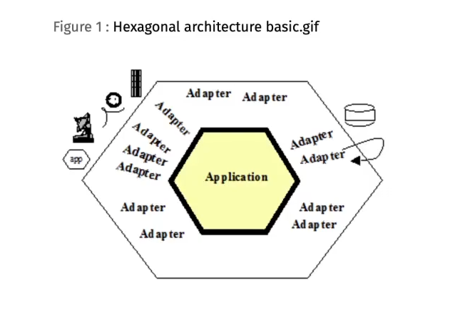

# Clean Architecture na prática e não no Hype

Introdução:
A Clean Architecture é uma abordagem de design de software que enfatiza a separação de preocupações, testabilidade e flexibilidade. Ela propõe uma estrutura onde as regras de negócio são independentes de frameworks, bancos de dados e interfaces de usuário. Existem várias arquiteturas que derivam da Clean Architecture, como Hexagonal Architecture, Onion Architecture e outras. Neste guia, vamos explorar os princípios fundamentais da Clean Architecture e como aplicá-los na prática.


1. independência de frameworks
2. Testabilidade
3. Independência de ui
4. Independência de banco de dados
5. Independência de agentes externos


## Inversão de Dependência

Um conceito central da Clean Architecture é a Inversão de Dependência, que sugere que as dependências devem ser direcionadas para abstrações, não para implementações concretas. Isso permite que o código seja mais flexível e fácil de testar. isso que r dizer 	que as camandas mais proxiumas do core do sitemas sempre devem depender de abstrações, e não de implementações concretas. Isso permite que o código seja mais flexível e fácil de testar.

```java

public interface criarUsuario {
	user toModel()
}

public class UsuarioRequest implements criarUsuario {
	private String nome;
	private String email;

	public UsuarioRequest(String nome, String email) {
		this.nome = nome;
		this.email = email;
	}

	@Override
	public User toModel() {
		return new User(nome, email);
	}
}


public UserService {
	private final UserRepository userRepository;

	public UserService(UserRepository userRepository) {
		this.userRepository = userRepository;
	}

	public void createUser(criarUsuario request) { // Método que recebe uma abstração criarUsuario
		User user = request.toModel();
		userRepository.save(user);
	}
}

```

esse código demonstra como a classe `UserService` depende de uma abstração `criarUsuario`, permitindo que diferentes implementações sejam passadas, facilitando testes e flexibilidade.

## Dando nome às camadas pela Clean Architecture

1. **Frameworks e Drivers** – Camada mais externa, onde estão os frameworks e bibliotecas que o sistema utiliza. Essa camada é responsável por interagir com o mundo externo, como interfaces de usuário, APIs, bancos de dados, etc.
2. **Interface Adapters** – Camada intermediária que adapta as interfaces externas para o formato que o sistema entende. Aqui, você pode ter controladores, gateways, etc.
3. **Application Business Rules** – Camada que contém as regras de negócio específicas da aplicação. Aqui, você define casos de uso e lógica de aplicação.
4. **Enterprise Business Rules** – Camada mais interna, onde estão as regras de negócio fundamentais do domínio. Essa camada é independente de qualquer tecnologia ou framework específico.

## Evite classes anêmicas

Evite criar classes anêmicas, que são classes que possuem pouca ou nenhuma lógica de negócio, apenas lógica de atribuição ou getters/setters. Sempre que possível, encapsule a lógica de negócio dentro da própria classe. Isso torna o código mais coeso, seguro e fácil de manter.

## Diferença entre Clean Architecture e arquitetura Hexagonal

Arquitetura hexagonal é um outro estilo que busca os mesmos objetivos declarados pela Clean Architecture. Na verdade, no próprio texto original de Bob Martin, ele cita a Arquitetura Hexagonal como uma das inspirações.

> Enquanto a Clean Architecture tenta explicita as camadas e suas dependências, a Arquitetura Hexagonal foca na separação entre o núcleo do sistema e as interfaces externas, permitindo que o núcleo seja testado de forma isolada. mas o coinceito de separação de preocupações e a independência de frameworks e interfaces são comuns a ambas.



## Relacionando arquitetura em camadas e DDD

Domain Driven Design também define princípios que influenciam tanto na escrita do código do dia a dia quanto a arquitetura que vai ser proposta para o software. Provavelmente é um dos livros mais densos que temos no mercado e cheio de boas ideias.
