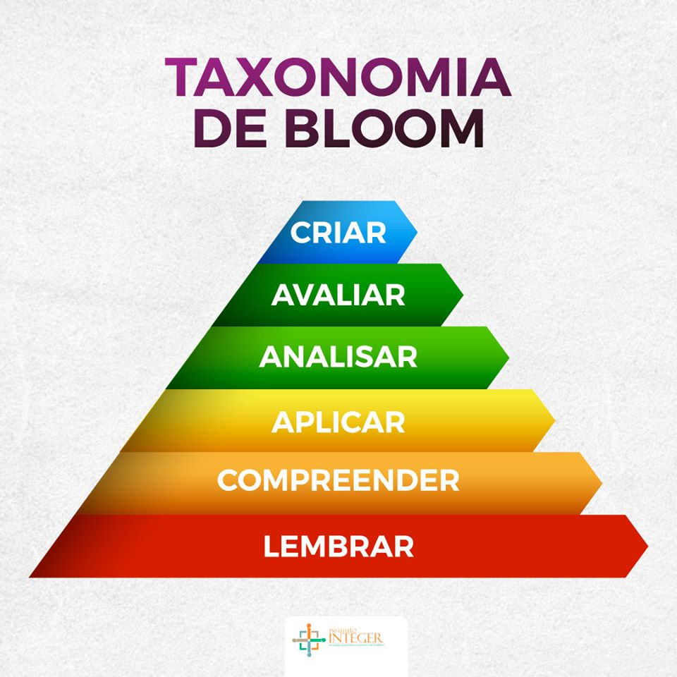

# Domain Driven Design: As partes que realmente importam

O foco deste curso é mostrar como aplicar os conceitos de Domain Driven Design (DDD) na prática, especialmente em relação ao desenvolvimento e requisitos de negócio. Vamos explorar como estruturar o código e as camadas de uma aplicação seguindo os princípios do DDD.

## Aprofundando o conhecimento no domínio: Parte 1

> Escrever software é materializar o desejo do negócio.

Independente do contexto em que o profissional está inserido, é de suma importância que o desenvolvedor tenha conhecimento do domínio em que está atuando. Seguindo a taxonomia de Bloom, recomenda-se ao menos o nível de compreender o domínio ou a parte em que estamos atuando. Isso significa entender os termos, regras e processos do negócio para criar soluções eficazes.

Estudar o contexto e avaliar para identificar os termos e regras do negócio é essencial para criar soluções eficazes. Buscar conhecimento com especialistas, analisar soluções existentes no mercado e entender por que uma solução foi escolhida em detrimento de outra são fatores fundamentais para o sucesso do projeto.

Ser proativo e perguntar para as pessoas que já atuam no domínio quais são as referências, termos e regras do negócio é uma prática recomendada. Procure saber também quais são as formas de propagação do conhecimento e se existe alguma documentação niveladora.

## A relação entre especialistas de domínio e em tecnologia

Tente ser o mais proximo possível dos especialistas de domínio. Isso não significa que você precisa se tornar um especialista no domínio, mas sim que deve ter uma compreensão suficiente para colaborar efetivamente com eles. A comunicação entre desenvolvedores e especialistas de domínio é crucial para o sucesso do projeto.

## Linguagem Ubíqua

A linguagem ubíqua é um conceito central no DDD, que busca criar uma linguagem comum entre desenvolvedores e especialistas de domínio. Essa linguagem deve ser usada em todo o projeto, desde o código até a documentação, para garantir que todos estejam na mesma página.

