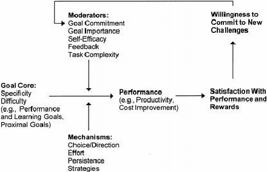

# [volta](../readme.md)
# Alinhamento de expectativa

## **Ponto de Reflexão: Dificuldade do Objetivo**

Este é um momento importante para **avaliar a complexidade** do seu objetivo e **alinhar expectativas**, evitando frustrações futuras.

### **Por que isso é importante?**
✅ **Evitar desistência:** Se o objetivo for subestimado, o aluno pode se sentir sobrecarregado e desistir.
✅ **Planejamento realista:** Entender o nível de dificuldade ajuda a definir prazos e métodos de estudo adequados.
✅ **Motivação constante:** Saber que o desafio é difícil, mas possível, mantém o foco e a disciplina.

## Autoeficácia
